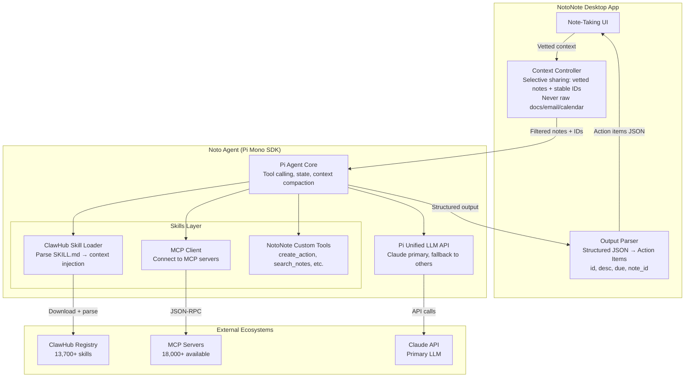

# NotoNote Agent Architecture: Research & Recommendation

**Date:** 2026-03-07
**Status:** Deep Dive
**MVP Focus:** Claude tools + OpenClaw/ClawHub skills
**Design Principle:** Noto = the ONE orchestrator that manages outside agents. Simplicity over hype.

---

## TL;DR Recommendation

**Use Pi Mono as the agent base.** It's embeddable (SDK/RPC mode), lightweight, and supports the same SKILL.md format as OpenClaw — meaning you get access to 13,700+ ClawHub skills without needing OpenClaw's heavy Gateway. Add MCP for Claude tools and external integrations. Noto becomes a thin orchestrator that delegates to skills and external agents while maintaining strict context control.

**Critical finding:** OpenClaw's core agent engine IS Pi Mono. Pi is literally the brain underneath OpenClaw's Gateway. Using Pi Mono directly means you get the same agent engine without the Gateway overhead.

**Why not OpenClaw directly?** Its Plugin SDK requires the full Gateway running (~200-300MB idle per instance). At 1,000 users, that's 200-300GB of RAM just for gateways. The codebase is 400K LOC with a code quality audit score of 15/100 for documentation and $373K estimated tech debt. Pi Mono's SDK mode embeds into your own process — you control the footprint.

**Why not build from scratch?** Pi Mono's unified LLM API, tool-calling harness, and extension system would take months to rebuild. It's 20.9k stars, MIT licensed, actively maintained with 3,131 commits.

**Project stability note:** Peter Steinberger (OpenClaw creator) joined OpenAI; OpenClaw is moving to a foundation. Pi Mono (by Mario Zechner/badlogic) remains independently maintained.

---

## Repo Analysis

### OpenClaw (`openclaw/openclaw`)

| Aspect | Assessment |
|--------|------------|
| **Stars/Activity** | 200,000+ stars, 600+ contributors, fastest-growing GitHub repo ever |
| **Creator** | Peter Steinberger (PSPDFKit founder) — now at OpenAI; project moving to foundation |
| **Language** | TypeScript (Node.js >= 22), pnpm monorepo, tsdown bundler |
| **Architecture** | Gateway-centric — always-on control plane. **Core agent engine is Pi Mono** (badlogic/pi-mono). Binds port 18789. WebSocket + JSON frames, TypeBox schemas |
| **Codebase** | ~400,000 LOC. Code quality audit: 98% modern TS, but 15/100 documentation, $373K tech debt, 111 unsafe coding practices |
| **Skills** | SKILL.md with YAML frontmatter + markdown instructions. 13,729+ on ClawHub. Injected into system prompt as compact XML (~24 tokens/skill) |
| **Multi-tenant** | **Single-user by design.** Multi-tenant = separate containers per user. Idle: 200-300MB RAM, active: 400-600MB per instance |
| **SDK/Embed** | Plugin SDK (`openclaw/plugin-sdk`) — but **requires Gateway running**. No standalone embed mode |
| **Agent-to-Agent** | `acpx` — headless CLI client for Agent Client Protocol (ACP). Persistent sessions, multi-turn |
| **LLM support** | 12+ providers: OpenAI, Anthropic, Ollama, OpenRouter, Gemini, Vertex, Bedrock, xAI, Groq, Cerebras, Mistral, GitHub Copilot. Fallback chains supported |
| **Security** | CVE-2026-25253 (CVSS 8.8, patched). ClawHavoc malware campaign. VirusTotal partnership for ClawHub scanning. 30,000+ publicly exposed instances found |
| **License** | MIT |

**Strengths for NotoNote:** Massive skill ecosystem (13.7k+), battle-tested at scale, active community.
**Weaknesses for NotoNote:** Gateway-heavy (not embeddable without it), single-user trust model, security track record, container-per-user scaling is expensive.

### Pi Mono (`badlogic/pi-mono`)

| Aspect | Assessment |
|--------|------------|
| **Stars/Activity** | 20,900 stars, 2,200 forks, 3,131 commits, 83 releases. Very aggressive release cadence |
| **Creator** | Mario Zechner (badlogic) — creator of libGDX game framework. Solo maintainer origin, community forks exist (oh-my-pi) |
| **Language** | TypeScript 96.6%, JavaScript 2.1%, MIT license. Strict TS — no `any` types |
| **Architecture** | Layered monorepo: `pi-ai` (LLM API) → `pi-agent-core` (agent loop) → `pi-coding-agent` (CLI). **NotoNote only needs the first two layers.** Other packages: `pi-mom` (Slack), `pi-tui`, `pi-web-ui`, `pi-pods` (vLLM) |
| **Core philosophy** | 4 built-in tools (read/write/edit/bash), system prompt <1,000 tokens. No sub-agents, no plan mode. "If the agent can write and run code, it should extend itself" |
| **Modes** | **4 modes: Interactive, Print/JSON, RPC (stdin/stdout), SDK (`createAgentSession()`)** |
| **Skills** | SKILL.md following AgentSkills spec (same format as OpenClaw). `/skill:name` invocation or auto-matching. Compatible with Claude's skills directory convention |
| **Skill discovery** | Global (`~/.pi/agent/skills/`, `~/.agents/skills/`), Project (`.pi/skills/`), Packages (`pi.skills` in package.json), Settings, CLI flags |
| **Multi-tenant** | No built-in multi-tenant — but SDK mode means you control isolation |
| **SDK/Embed** | **`createAgentSession()` — the exact API OpenClaw uses internally.** Serializable contexts enable mid-session provider handoffs. TypeBox schema-based tools for type-safe function calling |
| **LLM support** | **18+ providers** via unified API: OpenAI, Anthropic, Google, Vertex, Mistral, Groq, Cerebras, xAI, OpenRouter, Bedrock, GitHub Copilot, + any OpenAI-compatible. Mid-session model switching. Only tool-calling models |
| **Sessions** | JSONL files with tree structure (id + parentId). In-place branching, rewind, fork. Context compaction for long conversations |
| **Extensions** | TypeScript modules: lifecycle hooks, custom tools, commands. Can override built-in tools (with warning) |
| **Security** | "Pi packages run with full system access" — honest trust-based model, no security scanning |
| **License** | MIT |

**Strengths for NotoNote:** Embeddable via `createAgentSession()` (same API OpenClaw uses), lightweight layered architecture (only import what you need), unified 18+ LLM API with mid-session switching, same skill format as OpenClaw, serializable contexts, TypeBox type-safe tools.
**Weaknesses for NotoNote:** Smaller ecosystem than ClawHub, no built-in multi-tenant, solo maintainer risk (mitigated by MIT license + forks), less battle-tested at extreme scale.

**How OpenClaw uses Pi (confirmed pattern for NotoNote to follow):**
- OpenClaw imports `createAgentSession()` from Pi's SDK
- Pi handles: LLM communication, tool calling, context management, conversation loop
- OpenClaw handles: channel routing, session persistence, memory, skill discovery, sandboxing
- OpenClaw replaces Pi's `bash` tool with its own `exec/process` tools for sandboxing
- An adapter (`pi-tool-definition-adapter.ts`) bridges tool interfaces

### Comparison Matrix

| Criteria | OpenClaw | Pi Mono | Winner for NotoNote |
|----------|----------|---------|---------------------|
| Embeddable (no gateway) | No — Gateway required | **Yes — SDK + RPC modes** | Pi Mono |
| Skill ecosystem size | 13,700+ ClawHub | Smaller (npm/Discord) | OpenClaw |
| Skill format | SKILL.md (AgentSkills) | SKILL.md (AgentSkills) | **Tie — same format** |
| RAM per user (embedded) | 200-300MB (Gateway) | Controllable (SDK) | Pi Mono |
| Multi-LLM support | Plugin-based | **Built-in unified API** | Pi Mono |
| Codebase clarity | Large monorepo | **Clean 7-package split** | Pi Mono |
| Agent-to-agent | ACPX (ACP protocol) | RPC mode | Both viable |
| Security posture | CVEs + malware incidents | Honest trust model | Pi Mono (simpler) |
| Community/support | 196k stars, massive | 21k stars, solid | OpenClaw |
| Development velocity | Slower (large codebase) | **Faster (small, clean)** | Pi Mono |

---

## Skills Ecosystem Analysis (MVP Priority)

### CRITICAL FINDING: The Universal Bridge Already Exists

**The industry converged faster than expected.** Two standards won:
1. **Agent Skills (SKILL.md)** — open standard (Dec 2025). A SKILL.md file works unchanged across **30+ agent platforms**: Claude Code, Codex CLI, Cursor, GitHub Copilot, Gemini, and more.
2. **MCP (Model Context Protocol)** — open protocol for tool connectivity. 10,000+ servers. Donated to Linux Foundation's Agentic AI Foundation (AAIF) in Dec 2025, co-founded by Anthropic, Block, and OpenAI.

**NotoNote doesn't need to build custom bridges.** The SKILL.md format IS the bridge. MCP IS the tool protocol. Just consume them.

**skills.sh** (by Vercel, launched Jan 2026) is the **"npm for agent skills"** — universal registry with CLI (`npx skills add/find`), supports 37+ agent platforms, Snyk security scanning. Top skill hit 20K installs within 6 hours of launch.

### 1. Agent Skills / SKILL.md — THE STANDARD (MVP)

- **Format:** SKILL.md with YAML frontmatter + markdown body (open standard since Dec 2025)
- **Portability:** Works across Claude Code, Codex CLI, Cursor, GitHub Copilot, Gemini, and 30+ platforms **unchanged**
- **Registries:** ClawHub (13,729+ skills), skills.sh (Vercel, universal), github.com/openai/skills (curated)
- **Discovery:** Progressive disclosure — agent loads name+description at startup, full SKILL.md only when needed (~24 tokens/skill metadata)
- **Security:** skills.sh uses Snyk scanning. ClawHub uses VirusTotal + SHA-256 + Gemini code analysis
- **How they work:** Agent matches request → reads SKILL.md instructions → follows them using tools. No SDK, no runtime — just markdown.

```yaml
# Example SKILL.md (works on Claude, Codex, Cursor, Copilot, etc.)
---
name: todoist-manager
description: Manage tasks via the Todoist API
version: 1.0.0
metadata:
  openclaw:
    requires:
      env:
        - TODOIST_API_KEY
      bins:
        - curl
    primaryEnv: TODOIST_API_KEY
---

# Instructions (markdown)
When the user asks to manage Todoist tasks...
1. Use curl to call the Todoist API
2. Parse the JSON response
3. Present results in a structured format
```

**Bridge feasibility: SOLVED.** The format IS the bridge. Pi Mono already supports SKILL.md natively. ClawHub skills, skills.sh skills, and Codex skills all use the same format. No conversion needed.

### 2. MCP (Model Context Protocol) — THE PROTOCOL (MVP)

- **Format:** JSON-RPC 2.0 over STDIO or HTTP/SSE
- **Count:** 10,000+ public servers (MCP.so tracks 18,000+)
- **Governance:** Linux Foundation's Agentic AI Foundation (Anthropic + Block + OpenAI + Google + Microsoft + AWS)
- **Adoption:** Claude, ChatGPT, Cursor, Gemini, VS Code, GitHub Copilot, CrewAI, LangChain
- **SDK downloads:** 97M+ monthly (Python + TypeScript)
- **Claude specifics:** 75+ official connectors in Claude's directory

```typescript
// MCP tool definition (JSON Schema — same format Claude tools use)
{
  name: "create_action_item",
  description: "Create a new action item from meeting notes",
  input_schema: {
    type: "object",
    properties: {
      description: { type: "string" },
      due_date: { type: "string", format: "date" },
      note_id: { type: "string" }
    },
    required: ["description", "note_id"]
  }
}
```

**Bridge feasibility: NATIVE.** Claude's API uses the same JSON Schema format. Pi Mono's unified LLM API supports tool calling. MCP servers expose tools in this exact format. This is the natural integration path.

### 3. Claude Advanced Tools — ENHANCEMENT

Recent additions (late 2025) that Noto should leverage:
- **Tool Search Tool:** Dynamic tool discovery instead of loading all upfront. 85% reduction in token usage
- **Programmatic Tool Calling:** Tools invoked inside code execution environment, keeping results out of main context
- **Computer Use:** Beta — Claude controls a containerized desktop via screenshots + mouse/keyboard actions (Opus 4.6, Sonnet 4.6)

### 4. Codex CLI — FREE (same standard)

- **Uses the same SKILL.md format** — OpenAI adopted it within 48 hours of Anthropic's open standard announcement
- **Skills:** Read from `.agents/skills/`, user-level, admin-level directories
- **Installation:** `npx skills add` (skills.sh) or `$skill-installer`
- **No bridge needed** — same format as everything else

### 5. CrewAI / LangGraph — VIA MCP

- **Format:** Python BaseTool classes (CrewAI), @tool decorated functions (LangGraph)
- **Both have first-class MCP support** — CrewAI via `pip install crewai-tools[mcp]`, LangChain via `langchain-mcp`
- **Bridge path:** Expose Python tools as MCP servers → Noto consumes via MCP client. No Python runtime needed in Noto.
- **LangChain scale:** 1,000+ integrations, 70M+ monthly downloads, $1.25B valuation

### 6. Composio — OPTIONAL ACCELERATOR

- **What:** 850+ pre-built connectors, works with 25+ agent frameworks
- **Handles:** OAuth, API keys, auth centrally — the "OS layer" between agents and tools
- **Bridge path:** Composio connectors → exposed as MCP servers → Noto consumes
- **When to use:** If Noto needs rapid integration with enterprise tools (Salesforce, Slack, Jira, etc.) without building each connector

---

## Recommended Architecture

### Core Principle: Noto = Thin Orchestrator on Pi Mono Base

Noto doesn't try to BE a full agent framework. It uses Pi Mono's SDK as the engine and adds three things:
1. **Context controller** — decides what NotoNote data the agent sees
2. **Skills router** — loads ClawHub skills + MCP tools on demand
3. **Output enforcer** — ensures structured JSON output (action items)

### Architecture Diagram



### Component Breakdown

#### 1. Context Controller (NotoNote side)
```typescript
// NotoNote decides what the agent sees
interface AgentContext {
  notes: VettedNote[];        // Full content of relevant notes
  noteIds: string[];          // Stable IDs for back-references
  sessionHistory: Turn[];     // Previous turns in this conversation
  // NEVER: raw desktop docs, email, calendar, file system
}

interface VettedNote {
  id: string;                 // Stable ID
  content: string;            // Full vetted note content
  metadata: NoteMetadata;     // Created, modified, tags
}
```

#### 2. Noto Agent (Pi Mono SDK embedded)
```typescript
// This mirrors how OpenClaw embeds Pi — the proven integration pattern
import { createAgentSession } from '@mariozechner/pi-agent-core';
import { createLLMClient } from '@mariozechner/pi-ai';

// Create LLM client (unified API — same call for Claude, GPT, Gemini, etc.)
const llm = createLLMClient({
  provider: 'anthropic',
  model: 'claude-sonnet-4-6',  // or claude-opus-4-6 for complex tasks
});

// Create agent session — same API OpenClaw uses internally
const session = await createAgentSession({
  llm,
  tools: [
    ...notoNoteCustomTools,      // create_action, search_notes, etc.
    // TypeBox schema-based tools for type-safe function calling
  ],
  systemPrompt: buildNotoPrompt(context),
});

// Run a conversation turn (context is serializable — can switch LLM mid-session)
const result = await session.run(userMessage);

// Sessions stored as JSONL with tree structure — supports branching/rewind
// Context compaction built-in for long conversations (5-10 turn loops)
```

#### 3. ClawHub Skill Loader
```typescript
// Download and parse ClawHub skills — no runtime bridge needed
async function loadClawHubSkill(skillName: string): Promise<SkillDef> {
  // 1. Fetch SKILL.md from ClawHub API
  const skillMd = await fetchFromClawHub(skillName);

  // 2. Parse YAML frontmatter
  const { metadata, instructions } = parseSkillMd(skillMd);

  // 3. Check requirements (env vars, binaries)
  validateRequirements(metadata.requires);

  // 4. Return as injectable context (not a tool — an instruction set)
  return {
    name: metadata.name,
    description: metadata.description,
    instructions: instructions,  // Injected into agent context
    requirements: metadata.requires,
  };
}
```

#### 4. MCP Integration
```typescript
// Connect to MCP servers for Claude tools and external integrations
import { MCPClient } from 'mcp-client';

async function connectMCPServer(serverConfig: MCPServerConfig) {
  const client = new MCPClient(serverConfig);
  await client.connect();

  // Discover available tools
  const tools = await client.listTools();

  // Register as agent tools
  return tools.map(tool => ({
    name: tool.name,
    description: tool.description,
    inputSchema: tool.inputSchema,
    execute: (input) => client.callTool(tool.name, input),
  }));
}
```

#### 5. Output Enforcer
```typescript
// Ensure agent output matches NotoNote's expected format
interface ActionItem {
  id: string;           // Generated or from note
  description: string;  // Action description
  due: string | null;   // ISO date or null
  note_id: string;      // Back-reference to source note
}

// Validate and rehydrate in NotoNote
function parseAgentOutput(raw: string): ActionItem[] {
  const parsed = JSON.parse(raw);
  return parsed.actions.map(validateActionItem);
}
```

---

## Why This Architecture

### vs. OpenClaw Gateway (Scenario B)

| Factor | Pi Mono SDK | OpenClaw Gateway |
|--------|------------|-----------------|
| RAM per user | ~50-100MB (embedded) | 200-300MB (Gateway) |
| 1,000 users | ~50-100GB | 200-300GB |
| ClawHub access | **Yes** — parse SKILL.md directly | Native |
| Startup time | Instant (SDK call) | Seconds (Gateway boot) |
| Control | Full — you own the process | Partial — Gateway owns state |
| Complexity | Low — SDK is a library call | High — full gateway lifecycle |

### vs. Custom from scratch (Scenario D)

| Factor | Pi Mono SDK | Custom Build |
|--------|------------|-------------|
| LLM abstraction | **Built-in** (OpenAI/Anthropic/Google) | Build it |
| Tool calling harness | **Built-in** | Build it |
| Context compaction | **Built-in** | Build it |
| Session management | **Built-in** (JSONL) | Build it |
| Time to MVP | Weeks | Months |

### vs. Direct Claude API only

| Factor | Pi Mono SDK | Raw Claude API |
|--------|------------|---------------|
| Multi-LLM fallback | Yes | No (Claude only) |
| Tool dispatch | Built-in | Build it |
| Context management | Built-in | Build it |
| Extension system | Built-in | Build it |
| Cost tracking | Built-in | Build it |

---

## Multi-Tenant Strategy (1,000+ users)

Pi Mono SDK embeds in your process — so multi-tenancy is **your application's concern**, not the agent framework's. This is actually better:

```
NotoNote Backend (K8s)
├── API Gateway (auth, rate limiting, routing)
├── Agent Workers (horizontal pods)
│   ├── Each pod runs N agent sessions via Pi SDK
│   ├── Sessions are stateless between requests (JSONL state stored externally)
│   └── Scale pods based on concurrent session count
├── State Store (Redis/PostgreSQL)
│   ├── Session state (JSONL conversation history)
│   ├── User preferences (model, skills, etc.)
│   └── Cached skill definitions
└── Skills Cache (Redis)
    ├── Parsed ClawHub SKILL.md files
    └── MCP server connection pools
```

**Cost estimate at 1,000 users:**
- Claude API: ~$0.03-0.05/user/month (assuming 5 sessions/day, 8 turns each, Sonnet)
- Infra: ~$0.01-0.02/user/month (shared K8s pods, not per-user containers)
- Total: **~$0.04-0.07/user/month** — within your $0.05 target with Sonnet

---

## Universal Skills Strategy

### MVP (Claude + OpenClaw)

```
┌─────────────────────────────────────────────┐
│              Noto Agent (Pi SDK)             │
│                                             │
│  ┌─────────────┐  ┌──────────────────────┐  │
│  │ Custom Tools │  │  Skill Loader        │  │
│  │             │  │  ┌────────────────┐  │  │
│  │ • create_   │  │  │ ClawHub Parser │  │  │
│  │   action    │  │  │ (YAML+MD→ctx)  │  │  │
│  │ • search_   │  │  └────────────────┘  │  │
│  │   notes     │  │  ┌────────────────┐  │  │
│  │ • update_   │  │  │ MCP Client     │  │  │
│  │   action    │  │  │ (JSON-RPC)     │  │  │
│  │             │  │  └────────────────┘  │  │
│  └─────────────┘  └──────────────────────┘  │
│                                             │
│  ┌─────────────────────────────────────────┐│
│  │        Claude API (primary LLM)         ││
│  └─────────────────────────────────────────┘│
└─────────────────────────────────────────────┘
         │                    │
         ▼                    ▼
   ClawHub Registry     MCP Servers
   (13,700+ skills)     (18,000+ tools)
```

### Why No Custom Bridge Is Needed

The industry converged on two standards in late 2025:

| Layer | Standard | What It Does | Noto's Role |
|-------|----------|-------------|-------------|
| **Behavior** | Agent Skills (SKILL.md) | Portable agent instructions | Consume natively (Pi supports it) |
| **Protocol** | MCP (JSON-RPC 2.0) | Tool discovery + invocation | Connect as MCP client |
| **Registry** | skills.sh + ClawHub | Discover + install skills | Pull from both |
| **API description** | OpenAPI | Describe HTTP endpoints | Auto-convert to MCP via Gentoro/Google ADK |

| Ecosystem | Bridge Method | Effort |
|-----------|--------------|--------|
| ClawHub (13,700+ skills) | **Native** — same SKILL.md format | **Zero** |
| skills.sh (Vercel registry) | `npx skills add` → same SKILL.md | **Zero** |
| Codex CLI skills | **Native** — same SKILL.md format (adopted within 48hrs) | **Zero** |
| MCP servers (10,000+) | MCP client → tool registration | **Low** (standard protocol) |
| CrewAI/LangGraph tools | Already expose via MCP (`crewai-tools[mcp]`) | **Low** (consume MCP) |
| Any REST API | OpenAPI spec → MCP server (Gentoro, Google ADK) | **Low** |
| Composio (850+ connectors) | Composio → MCP server exposure | **Low** |

**Key insight:** The "USB-C moment" for agent skills already happened. Noto just plugs in.

---

## Risk Assessment

| Risk | Likelihood | Mitigation |
|------|-----------|------------|
| Malicious skills (ClawHub/skills.sh) | **High** (ClawHavoc already happened) | Only allow whitelisted skills. Use skills.sh (Snyk-scanned) over raw ClawHub. Run in sandboxed environment |
| Pi Mono breaking changes | Medium | Pin versions. Fork if necessary (MIT license, small codebase) |
| Claude API cost spikes | Medium | Use Sonnet for routine, Opus for complex. Token budgets per user. Mid-session model switching via Pi |
| Pi Mono project abandonment | Low (20.9k stars, active) | MIT license, can fork. oh-my-pi fork exists. Small enough to maintain |
| MCP protocol instability | **Low** (Linux Foundation governance, Anthropic + OpenAI + Google backing) | Protocol is stabilizing, v0.1 API frozen |
| Skills standard fragmentation | **Very Low** | Already adopted by 30+ platforms in <3 months. This ship has sailed |

---

## Implementation Roadmap (MVP)

### Phase 1: Core Agent (Week 1-2)
- Embed Pi Mono SDK in NotoNote backend
- Wire up Claude as primary LLM
- Implement 3 custom NotoNote tools: `create_action`, `search_notes`, `update_action`
- Context controller: selective note sharing with stable IDs
- Output enforcer: validate JSON action item format

### Phase 2: Skills Ecosystem (Week 3)
- Pi already supports SKILL.md natively — configure skill discovery paths
- Install curated skills via `npx skills add` (skills.sh, Snyk-scanned)
- Skill whitelist system (only approved skills per tenant)
- Test with 5-10 high-value skills from skills.sh + ClawHub (calendar, task management, summarization)

### Phase 3: MCP Integration (Week 4)
- MCP client for connecting to external tool servers
- Start with 2-3 MCP servers (web search, Slack/email, calendar)
- Tool registration: MCP tools → Pi agent tool definitions
- Leverage Claude's Tool Search Tool for dynamic tool discovery (85% token savings)

### Phase 4: Multi-Tenant & Scale (Week 5-6)
- Horizontal pod scaling for agent workers
- Session state externalization (Redis/PostgreSQL)
- Skills cache (parsed SKILL.md + MCP connections)
- Rate limiting and cost tracking per user

---

## Sources

### OpenClaw
- [OpenClaw GitHub](https://github.com/openclaw/openclaw)
- [ClawHub Registry](https://clawhub.ai/)
- [ClawHub Skill Format](https://github.com/openclaw/clawhub/blob/main/docs/skill-format.md)
- [OpenClaw Skills Docs](https://docs.openclaw.ai/tools/skills)
- [OpenClaw Architecture Guide (Valletta)](https://vallettasoftware.com/blog/post/openclaw-2026-guide)
- [OpenClaw Architecture Deep Dive (Medium)](https://medium.com/@dingzhanjun/deep-dive-into-openclaw-architecture-code-ecosystem-e6180f34bd07)
- [OpenClaw Security (Nebius)](https://nebius.com/blog/posts/openclaw-security)
- [OpenClaw Multi-Tenant Docker (ClawTank)](https://clawtank.dev/blog/openclaw-multi-tenant-docker-guide)
- [ACPX - Headless Agent Client](https://github.com/openclaw/acpx)
- [OpenClaw npm package](https://www.npmjs.com/package/openclaw)
- [Awesome OpenClaw Skills (5,400+ curated)](https://github.com/VoltAgent/awesome-openclaw-skills)
- [ClawHavoc Malware Campaign (VirusTotal)](https://blog.virustotal.com/2026/02/from-automation-to-infection-how.html)
- [OpenClaw Security Concerns (1Password)](https://1password.com/blog/from-magic-to-malware-how-openclaws-agent-skills-become-an-attack-surface)

### Pi Mono
- [Pi Mono GitHub](https://github.com/badlogic/pi-mono)
- [Pi Coding Agent README](https://github.com/badlogic/pi-mono/blob/main/packages/coding-agent/README.md)
- [Pi AI (Unified LLM API) README](https://github.com/badlogic/pi-mono/blob/main/packages/ai/README.md)
- [Pi Skills Documentation](https://github.com/badlogic/pi-mono/blob/main/packages/coding-agent/docs/skills.md)
- [Pi Extensions Documentation](https://github.com/badlogic/pi-mono/blob/main/packages/coding-agent/docs/extensions.md)
- [Pi Models Documentation](https://github.com/badlogic/pi-mono/blob/main/packages/coding-agent/docs/models.md)
- [Pi SDK Documentation](https://github.com/badlogic/pi-mono/blob/main/packages/coding-agent/docs/sdk.md)
- [AGENTS.md (coding standards)](https://github.com/badlogic/pi-mono/blob/main/AGENTS.md)
- [Pi Releases](https://github.com/badlogic/pi-mono/releases)
- [Pi: The Minimal Agent Inside OpenClaw](https://akillness.github.io/posts/pi-minimal-agent/)
- [How to Build a Custom Agent Framework with Pi (Nader Dabit)](https://nader.substack.com/p/how-to-build-a-custom-agent-framework)
- [OpenClaw Architecture Lessons (Agentailor)](https://blog.agentailor.com/posts/openclaw-architecture-lessons-for-agent-builders)
- [oh-my-pi Fork](https://github.com/can1357/oh-my-pi)
- [Pi Mono on Hacker News](https://news.ycombinator.com/item?id=46629341)

### MCP (Model Context Protocol)
- [MCP Official Registry](https://registry.modelcontextprotocol.io/)
- [MCP GitHub](https://github.com/modelcontextprotocol)
- [MCP Servers Directory (18,000+)](https://mcp.so/)
- [PulseMCP (8,590+ servers)](https://www.pulsemcp.com/servers)
- [MCP Registry Blog Post](http://blog.modelcontextprotocol.io/posts/2025-09-08-mcp-registry-preview/)

### Agent Skills Open Standard
- [Agent Skills Standard Announcement (Anthropic)](https://opentools.ai/news/anthropic-introduces-agent-skills-as-open-ai-standard-a-new-era-of-cross-platform-portability)
- [Standard Adopted in 48 Hours (Microsoft + OpenAI)](https://byteiota.com/agent-skills-standard-microsoft-openai-adopt-in-48-hours/)
- [skills.sh — Vercel Universal Skills Registry](https://vercel.com/changelog/introducing-skills-the-open-agent-skills-ecosystem)
- [skills.sh Analysis (InfoQ)](https://www.infoq.com/news/2026/02/vercel-agent-skills/)
- [Snyk + Vercel Skills Security](https://snyk.io/blog/snyk-vercel-securing-agent-skill-ecosystem/)
- [Claude Skills Deep Dive](https://leehanchung.github.io/blogs/2025/10/26/claude-skills-deep-dive/)
- [Skills Explained — Claude Blog](https://claude.com/blog/skills-explained)

### Claude Tools & Advanced Features
- [Anthropic Advanced Tool Use](https://www.anthropic.com/engineering/advanced-tool-use)
- [Claude Programmatic Tool Calling](https://platform.claude.com/docs/en/agents-and-tools/tool-use/programmatic-tool-calling)
- [Claude Computer Use Tool](https://platform.claude.com/docs/en/agents-and-tools/tool-use/computer-use-tool)

### Codex CLI
- [OpenAI Codex Skills Developer Docs](https://developers.openai.com/codex/skills/)
- [OpenAI Skills GitHub](https://github.com/openai/skills)
- [Simon Willison on OpenAI Adopting Skills](https://simonwillison.net/2025/Dec/12/openai-skills/)

### Other Ecosystems
- [CrewAI Custom Tools](https://docs.crewai.com/en/learn/create-custom-tools)
- [LangChain](https://www.langchain.com/langchain)
- [Composio Platform (850+ connectors)](https://composio.dev/)
- [Anthropic Donates MCP to Linux Foundation AAIF](https://www.anthropic.com/news/donating-the-model-context-protocol-and-establishing-of-the-agentic-ai-foundation)
- [A Year of MCP Review](https://www.pento.ai/blog/a-year-of-mcp-2025-review)

### Skills Ecosystem (General)
- [OpenClaw Skills Guide (DigitalOcean)](https://www.digitalocean.com/resources/articles/what-are-openclaw-skills)
- [Best ClawHub Skills (DataCamp)](https://www.datacamp.com/blog/best-clawhub-skills)
- [OpenClaw Plugin SDK Deep Dive](https://dev.to/wonderlab/openclaw-deep-dive-4-plugin-sdk-and-extension-development-51ki)
- [Agent Skills as Enterprise Standard](https://subramanya.ai/2025/12/18/agent-skills-the-missing-piece-of-the-enterprise-ai-puzzle/)
