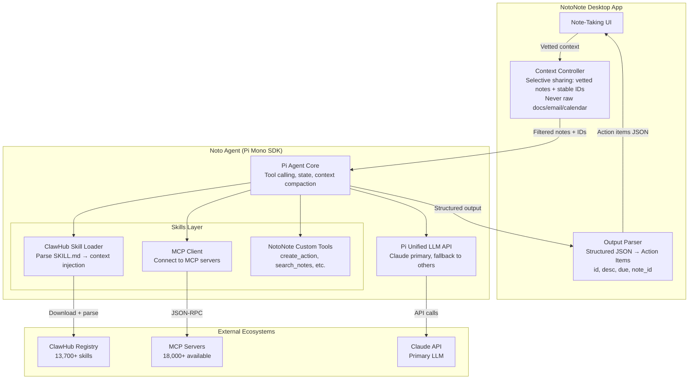

# NotoNote Agent Architecture: Research & Recommendation

**Date:** 2026-03-07
**Status:** Deep Dive
**MVP Focus:** Claude tools + OpenClaw/ClawHub skills
**Design Principle:** Noto = the ONE orchestrator that manages outside agents. Simplicity over hype.

---

## TL;DR Recommendation

**Use Pi Mono as the agent base.** It's embeddable (SDK/RPC mode), lightweight, and supports the same SKILL.md format as OpenClaw — meaning you get access to 13,700+ ClawHub skills without needing OpenClaw's heavy Gateway. Add MCP for Claude tools and external integrations. Noto becomes a thin orchestrator that delegates to skills and external agents while maintaining strict context control.

**Why not OpenClaw directly?** Its Plugin SDK requires the full Gateway running (~200-300MB idle per instance). At 1,000 users, that's 200-300GB of RAM just for gateways. Pi Mono's SDK mode embeds into your own process — you control the footprint.

**Why not build from scratch?** Pi Mono's unified LLM API, tool-calling harness, and extension system would take months to rebuild. It's 20.9k stars, MIT licensed, actively maintained with 3,131 commits.

---

## Repo Analysis

### OpenClaw (`openclaw/openclaw`)

| Aspect | Assessment |
|--------|------------|
| **Stars/Activity** | 196,000+ stars, 600+ contributors, massively active |
| **Language** | TypeScript (Node.js >= 22), pnpm monorepo, tsdown bundler |
| **Architecture** | Gateway-centric — the Gateway is an always-on control plane managing sessions, channels, tools, events. Binds port 18789. WebSocket + JSON frames, TypeBox schemas |
| **Core size** | ~8MB after 2026 refactor, but the Gateway is the mandatory runtime |
| **Skills** | SKILL.md with YAML frontmatter + markdown instructions. 13,729+ on ClawHub |
| **Multi-tenant** | **Single-user by design.** Multi-tenant = separate containers per user. Idle: 200-300MB RAM, active: 400-600MB per instance |
| **SDK/Embed** | Plugin SDK (`openclaw/plugin-sdk`) — but **requires Gateway running**. No standalone embed mode |
| **Agent-to-Agent** | `acpx` — headless CLI client for Agent Client Protocol (ACP). Persistent sessions, multi-turn |
| **LLM support** | Multi-provider via plugins (model providers are external packages loaded dynamically) |
| **Security** | CVE-2026-25253 (CVSS 8.8, patched). ClawHavoc malware campaign. VirusTotal partnership for ClawHub scanning. 30,000+ publicly exposed instances found |
| **License** | MIT |

**Strengths for NotoNote:** Massive skill ecosystem (13.7k+), battle-tested at scale, active community.
**Weaknesses for NotoNote:** Gateway-heavy (not embeddable without it), single-user trust model, security track record, container-per-user scaling is expensive.

### Pi Mono (`badlogic/pi-mono`)

| Aspect | Assessment |
|--------|------------|
| **Stars/Activity** | 20,900 stars, 2,200 forks, 3,131 commits, 83 releases |
| **Language** | TypeScript 96.6%, JavaScript 2.1%, MIT license |
| **Architecture** | 7-package monorepo: `pi-ai` (LLM API), `pi-agent-core` (runtime), `pi-coding-agent` (CLI), `pi-mom` (Slack bot), `pi-tui`, `pi-web-ui`, `pi-pods` (vLLM) |
| **Core size** | Lightweight — designed as toolkit, not monolithic gateway |
| **Modes** | **4 modes: Interactive, Print/JSON, RPC (stdin/stdout), SDK (embed in your app)** |
| **Skills** | SKILL.md following AgentSkills spec (same format as OpenClaw). `/skill:name` invocation or auto-matching |
| **Multi-tenant** | No built-in multi-tenant — but SDK mode means you control isolation |
| **SDK/Embed** | **Yes — SDK mode for embedding in other applications. RPC mode for process integration.** This is the key differentiator |
| **LLM support** | Unified API: OpenAI, Anthropic, Google, + any OpenAI-compatible (Ollama, vLLM, LM Studio). Only models with tool calling |
| **Extensions** | TypeScript modules: lifecycle hooks, custom tools, commands. Can override built-in tools |
| **Security** | "Pi packages run with full system access" — honest about the trust model but no security scanning |
| **License** | MIT |

**Strengths for NotoNote:** Embeddable SDK mode, lightweight, unified LLM API, same skill format as OpenClaw, RPC mode for process integration, much smaller codebase to understand/maintain.
**Weaknesses for NotoNote:** Smaller ecosystem, no built-in multi-tenant, less battle-tested at extreme scale.

### Comparison Matrix

| Criteria | OpenClaw | Pi Mono | Winner for NotoNote |
|----------|----------|---------|---------------------|
| Embeddable (no gateway) | No — Gateway required | **Yes — SDK + RPC modes** | Pi Mono |
| Skill ecosystem size | 13,700+ ClawHub | Smaller (npm/Discord) | OpenClaw |
| Skill format | SKILL.md (AgentSkills) | SKILL.md (AgentSkills) | **Tie — same format** |
| RAM per user (embedded) | 200-300MB (Gateway) | Controllable (SDK) | Pi Mono |
| Multi-LLM support | Plugin-based | **Built-in unified API** | Pi Mono |
| Codebase clarity | Large monorepo | **Clean 7-package split** | Pi Mono |
| Agent-to-agent | ACPX (ACP protocol) | RPC mode | Both viable |
| Security posture | CVEs + malware incidents | Honest trust model | Pi Mono (simpler) |
| Community/support | 196k stars, massive | 21k stars, solid | OpenClaw |
| Development velocity | Slower (large codebase) | **Faster (small, clean)** | Pi Mono |

---

## Skills Ecosystem Analysis (MVP Priority)

### 1. OpenClaw/ClawHub Skills — PRIMARY

- **Format:** SKILL.md with YAML frontmatter + markdown body
- **Count:** 13,729+ skills on ClawHub registry
- **Discovery:** Vector search (embeddings), not just keywords
- **Security:** VirusTotal scanning, SHA-256 hashing, Gemini-powered code analysis
- **How they work:** Agent matches request → reads SKILL.md instructions → follows them using tools (bash, read, write, etc.)
- **Key insight:** Skills are just markdown instructions + optional scripts. **No SDK dependency.** Any agent that can read a SKILL.md and follow instructions can use them.

```yaml
# Example SKILL.md frontmatter
---
name: todoist-manager
description: Manage tasks via the Todoist API
version: 1.0.0
metadata:
  openclaw:
    requires:
      env:
        - TODOIST_API_KEY
      bins:
        - curl
    primaryEnv: TODOIST_API_KEY
---

# Instructions (markdown)
When the user asks to manage Todoist tasks...
1. Use curl to call the Todoist API
2. Parse the JSON response
3. Present results in a structured format
```

**Bridge feasibility: HIGH.** Since skills are just structured markdown, Noto can:
1. Download skills from ClawHub via its API
2. Parse YAML frontmatter for requirements/metadata
3. Inject the markdown instructions into the agent's context
4. Let Claude follow the instructions naturally

No runtime bridge needed — it's a content injection pattern.

### 2. Claude Tools / MCP — PRIMARY

- **Format:** JSON Schema tool definitions (name, description, input_schema)
- **Count:** 18,000+ MCP servers tracked (MCP.so), 8,590+ on PulseMCP
- **Protocol:** JSON-RPC over stdio or SSE (Server-Sent Events)
- **Registry:** Official MCP Registry (registry.modelcontextprotocol.io) — in preview
- **How they work:** Client connects to MCP server → discovers available tools → sends tool calls → receives results

```typescript
// Claude tool definition format
{
  name: "create_action_item",
  description: "Create a new action item from meeting notes",
  input_schema: {
    type: "object",
    properties: {
      description: { type: "string" },
      due_date: { type: "string", format: "date" },
      note_id: { type: "string" }
    },
    required: ["description", "note_id"]
  }
}
```

**Bridge feasibility: NATIVE.** Claude's API already supports tool calling. MCP servers expose tools in this exact format. Pi Mono's unified LLM API supports tool calling. This is the most natural integration path.

### 3. Codex CLI — STRETCH GOAL

- **What it is:** OpenAI's terminal-based coding agent
- **Skills:** Uses `instructions.md` files (similar concept to SKILL.md)
- **Bridge feasibility:** Medium — similar markdown-instruction pattern, but Codex is tightly coupled to OpenAI models

### 4. CrewAI / LangGraph — STRETCH GOAL

- **Format:** Python classes (CrewAI), Python functions (LangGraph)
- **Bridge feasibility:** Low for direct integration — different runtime (Python). Better to expose them as MCP servers and consume via MCP.

---

## Recommended Architecture

### Core Principle: Noto = Thin Orchestrator on Pi Mono Base

Noto doesn't try to BE a full agent framework. It uses Pi Mono's SDK as the engine and adds three things:
1. **Context controller** — decides what NotoNote data the agent sees
2. **Skills router** — loads ClawHub skills + MCP tools on demand
3. **Output enforcer** — ensures structured JSON output (action items)

### Architecture Diagram



### Component Breakdown

#### 1. Context Controller (NotoNote side)
```typescript
// NotoNote decides what the agent sees
interface AgentContext {
  notes: VettedNote[];        // Full content of relevant notes
  noteIds: string[];          // Stable IDs for back-references
  sessionHistory: Turn[];     // Previous turns in this conversation
  // NEVER: raw desktop docs, email, calendar, file system
}

interface VettedNote {
  id: string;                 // Stable ID
  content: string;            // Full vetted note content
  metadata: NoteMetadata;     // Created, modified, tags
}
```

#### 2. Noto Agent (Pi Mono SDK embedded)
```typescript
import { createAgent } from '@mariozechner/pi-agent-core';
import { createLLMClient } from '@mariozechner/pi-ai';

// Embed Pi's agent in NotoNote's process
const agent = createAgent({
  model: 'claude-sonnet-4-6',  // or claude-opus-4-6 for complex tasks
  tools: [
    ...notoNoteCustomTools,      // create_action, search_notes, etc.
    ...loadedClawHubSkills,      // Parsed SKILL.md → tool definitions
    ...mcpTools,                 // Connected MCP server tools
  ],
  systemPrompt: buildNotoPrompt(context),
  outputFormat: 'json',         // Enforce structured output
});

// Run a conversation turn
const result = await agent.run(userMessage, {
  maxTurns: 10,                 // Support 5-10 turn context loops
  contextWindow: 'compact',     // Auto-compact long conversations
});
```

#### 3. ClawHub Skill Loader
```typescript
// Download and parse ClawHub skills — no runtime bridge needed
async function loadClawHubSkill(skillName: string): Promise<SkillDef> {
  // 1. Fetch SKILL.md from ClawHub API
  const skillMd = await fetchFromClawHub(skillName);

  // 2. Parse YAML frontmatter
  const { metadata, instructions } = parseSkillMd(skillMd);

  // 3. Check requirements (env vars, binaries)
  validateRequirements(metadata.requires);

  // 4. Return as injectable context (not a tool — an instruction set)
  return {
    name: metadata.name,
    description: metadata.description,
    instructions: instructions,  // Injected into agent context
    requirements: metadata.requires,
  };
}
```

#### 4. MCP Integration
```typescript
// Connect to MCP servers for Claude tools and external integrations
import { MCPClient } from 'mcp-client';

async function connectMCPServer(serverConfig: MCPServerConfig) {
  const client = new MCPClient(serverConfig);
  await client.connect();

  // Discover available tools
  const tools = await client.listTools();

  // Register as agent tools
  return tools.map(tool => ({
    name: tool.name,
    description: tool.description,
    inputSchema: tool.inputSchema,
    execute: (input) => client.callTool(tool.name, input),
  }));
}
```

#### 5. Output Enforcer
```typescript
// Ensure agent output matches NotoNote's expected format
interface ActionItem {
  id: string;           // Generated or from note
  description: string;  // Action description
  due: string | null;   // ISO date or null
  note_id: string;      // Back-reference to source note
}

// Validate and rehydrate in NotoNote
function parseAgentOutput(raw: string): ActionItem[] {
  const parsed = JSON.parse(raw);
  return parsed.actions.map(validateActionItem);
}
```

---

## Why This Architecture

### vs. OpenClaw Gateway (Scenario B)

| Factor | Pi Mono SDK | OpenClaw Gateway |
|--------|------------|-----------------|
| RAM per user | ~50-100MB (embedded) | 200-300MB (Gateway) |
| 1,000 users | ~50-100GB | 200-300GB |
| ClawHub access | **Yes** — parse SKILL.md directly | Native |
| Startup time | Instant (SDK call) | Seconds (Gateway boot) |
| Control | Full — you own the process | Partial — Gateway owns state |
| Complexity | Low — SDK is a library call | High — full gateway lifecycle |

### vs. Custom from scratch (Scenario D)

| Factor | Pi Mono SDK | Custom Build |
|--------|------------|-------------|
| LLM abstraction | **Built-in** (OpenAI/Anthropic/Google) | Build it |
| Tool calling harness | **Built-in** | Build it |
| Context compaction | **Built-in** | Build it |
| Session management | **Built-in** (JSONL) | Build it |
| Time to MVP | Weeks | Months |

### vs. Direct Claude API only

| Factor | Pi Mono SDK | Raw Claude API |
|--------|------------|---------------|
| Multi-LLM fallback | Yes | No (Claude only) |
| Tool dispatch | Built-in | Build it |
| Context management | Built-in | Build it |
| Extension system | Built-in | Build it |
| Cost tracking | Built-in | Build it |

---

## Multi-Tenant Strategy (1,000+ users)

Pi Mono SDK embeds in your process — so multi-tenancy is **your application's concern**, not the agent framework's. This is actually better:

```
NotoNote Backend (K8s)
├── API Gateway (auth, rate limiting, routing)
├── Agent Workers (horizontal pods)
│   ├── Each pod runs N agent sessions via Pi SDK
│   ├── Sessions are stateless between requests (JSONL state stored externally)
│   └── Scale pods based on concurrent session count
├── State Store (Redis/PostgreSQL)
│   ├── Session state (JSONL conversation history)
│   ├── User preferences (model, skills, etc.)
│   └── Cached skill definitions
└── Skills Cache (Redis)
    ├── Parsed ClawHub SKILL.md files
    └── MCP server connection pools
```

**Cost estimate at 1,000 users:**
- Claude API: ~$0.03-0.05/user/month (assuming 5 sessions/day, 8 turns each, Sonnet)
- Infra: ~$0.01-0.02/user/month (shared K8s pods, not per-user containers)
- Total: **~$0.04-0.07/user/month** — within your $0.05 target with Sonnet

---

## Universal Skills Strategy

### MVP (Claude + OpenClaw)

```
┌─────────────────────────────────────────────┐
│              Noto Agent (Pi SDK)             │
│                                             │
│  ┌─────────────┐  ┌──────────────────────┐  │
│  │ Custom Tools │  │  Skill Loader        │  │
│  │             │  │  ┌────────────────┐  │  │
│  │ • create_   │  │  │ ClawHub Parser │  │  │
│  │   action    │  │  │ (YAML+MD→ctx)  │  │  │
│  │ • search_   │  │  └────────────────┘  │  │
│  │   notes     │  │  ┌────────────────┐  │  │
│  │ • update_   │  │  │ MCP Client     │  │  │
│  │   action    │  │  │ (JSON-RPC)     │  │  │
│  │             │  │  └────────────────┘  │  │
│  └─────────────┘  └──────────────────────┘  │
│                                             │
│  ┌─────────────────────────────────────────┐│
│  │        Claude API (primary LLM)         ││
│  └─────────────────────────────────────────┘│
└─────────────────────────────────────────────┘
         │                    │
         ▼                    ▼
   ClawHub Registry     MCP Servers
   (13,700+ skills)     (18,000+ tools)
```

### Future Expansion

| Ecosystem | Bridge Method | Effort |
|-----------|--------------|--------|
| ClawHub (OpenClaw) | Parse SKILL.md → context injection | **Low** (same format as Pi skills) |
| MCP servers | MCP client → tool registration | **Low** (standard protocol) |
| Codex CLI | Parse instructions.md → context injection | Medium (similar pattern) |
| CrewAI tools | Wrap as MCP server | Medium (Python→MCP bridge) |
| LangGraph | Wrap as MCP server | Medium (Python→MCP bridge) |
| Custom frameworks | OpenAPI spec → tool definition | Low-Medium |

**Key insight:** MCP is the universal bridge. Any ecosystem that can be wrapped as an MCP server becomes consumable by Noto. ClawHub skills don't even need a bridge — they're just markdown that any agent can follow.

---

## Risk Assessment

| Risk | Likelihood | Mitigation |
|------|-----------|------------|
| ClawHub malware in skills | **High** (already happened) | Only allow whitelisted skills. Run in sandboxed environment. Don't auto-install |
| Pi Mono breaking changes | Medium | Pin versions. Fork if necessary (MIT license, small codebase) |
| Claude API cost spikes | Medium | Use Sonnet for routine, Opus for complex. Token budgets per user |
| Pi Mono project abandonment | Low (20.9k stars, active) | MIT license, can fork. Small enough to maintain |
| MCP protocol instability | Low (backed by Anthropic) | Registry still in preview, but protocol is stabilizing |

---

## Implementation Roadmap (MVP)

### Phase 1: Core Agent (Week 1-2)
- Embed Pi Mono SDK in NotoNote backend
- Wire up Claude as primary LLM
- Implement 3 custom NotoNote tools: `create_action`, `search_notes`, `update_action`
- Context controller: selective note sharing with stable IDs
- Output enforcer: validate JSON action item format

### Phase 2: ClawHub Skills (Week 3)
- Build ClawHub SKILL.md parser (YAML frontmatter + markdown body)
- Skill whitelist system (curated list of safe, useful skills)
- Context injection: parsed skill instructions → agent system prompt
- Test with 5-10 high-value skills (calendar, task management, summarization)

### Phase 3: MCP Integration (Week 4)
- MCP client for connecting to external tool servers
- Start with 2-3 MCP servers (filesystem, web search, Slack/email)
- Tool registration: MCP tools → Pi agent tool definitions

### Phase 4: Multi-Tenant & Scale (Week 5-6)
- Horizontal pod scaling for agent workers
- Session state externalization (Redis/PostgreSQL)
- Skills cache (parsed SKILL.md + MCP connections)
- Rate limiting and cost tracking per user

---

## Sources

### OpenClaw
- [OpenClaw GitHub](https://github.com/openclaw/openclaw)
- [ClawHub Registry](https://clawhub.ai/)
- [ClawHub Skill Format](https://github.com/openclaw/clawhub/blob/main/docs/skill-format.md)
- [OpenClaw Skills Docs](https://docs.openclaw.ai/tools/skills)
- [OpenClaw Architecture Guide (Valletta)](https://vallettasoftware.com/blog/post/openclaw-2026-guide)
- [OpenClaw Architecture Deep Dive (Medium)](https://medium.com/@dingzhanjun/deep-dive-into-openclaw-architecture-code-ecosystem-e6180f34bd07)
- [OpenClaw Security (Nebius)](https://nebius.com/blog/posts/openclaw-security)
- [OpenClaw Multi-Tenant Docker (ClawTank)](https://clawtank.dev/blog/openclaw-multi-tenant-docker-guide)
- [ACPX - Headless Agent Client](https://github.com/openclaw/acpx)
- [OpenClaw npm package](https://www.npmjs.com/package/openclaw)
- [Awesome OpenClaw Skills (5,400+ curated)](https://github.com/VoltAgent/awesome-openclaw-skills)
- [ClawHavoc Malware Campaign (VirusTotal)](https://blog.virustotal.com/2026/02/from-automation-to-infection-how.html)
- [OpenClaw Security Concerns (1Password)](https://1password.com/blog/from-magic-to-malware-how-openclaws-agent-skills-become-an-attack-surface)

### Pi Mono
- [Pi Mono GitHub](https://github.com/badlogic/pi-mono)
- [Pi Coding Agent README](https://github.com/badlogic/pi-mono/blob/main/packages/coding-agent/README.md)
- [Pi AI (Unified LLM API) README](https://github.com/badlogic/pi-mono/blob/main/packages/ai/README.md)
- [Pi Skills Documentation](https://github.com/badlogic/pi-mono/blob/main/packages/coding-agent/docs/skills.md)
- [Pi Extensions Documentation](https://github.com/badlogic/pi-mono/blob/main/packages/coding-agent/docs/extensions.md)
- [Pi Models Documentation](https://github.com/badlogic/pi-mono/blob/main/packages/coding-agent/docs/models.md)
- [Pi SDK Documentation](https://github.com/badlogic/pi-mono/blob/main/packages/coding-agent/docs/sdk.md)

### MCP (Model Context Protocol)
- [MCP Official Registry](https://registry.modelcontextprotocol.io/)
- [MCP GitHub](https://github.com/modelcontextprotocol)
- [MCP Servers Directory (18,000+)](https://mcp.so/)
- [PulseMCP (8,590+ servers)](https://www.pulsemcp.com/servers)
- [MCP Registry Blog Post](http://blog.modelcontextprotocol.io/posts/2025-09-08-mcp-registry-preview/)

### Skills Ecosystem (General)
- [OpenClaw Skills Guide (DigitalOcean)](https://www.digitalocean.com/resources/articles/what-are-openclaw-skills)
- [Best ClawHub Skills (DataCamp)](https://www.datacamp.com/blog/best-clawhub-skills)
- [OpenClaw Plugin SDK Deep Dive](https://dev.to/wonderlab/openclaw-deep-dive-4-plugin-sdk-and-extension-development-51ki)
